# SAND-UP - Strange ASV Names Detector Using Phylogenetic trees
Scripts to create phylogenetic trees based on taxonomic assignments of Environmental DNA (eDNA) data in order to **detect possible misassigned** ASVs or **refine the taxonomic assignment** of some ASVs.

<p align="center">

</p>

- [Description](#description)  
- [Installation](#installation)  
- [Preparation of the files](#preparation-of-the-files)   
- [Usage of Family tree script](#usage-of-family-tree-script)
- [Usage of Location tree script](#usage-of-location-tree-script)

## Description
This repository contains 2 different scripts to plot phylogenetic trees based on taxonomic assignments of Environmental DNA (eDNA) data.

There is 2 different methods to generate a phylogenetic tree.

### Location based method
This method gives the possibility to plot all your assigned ASVs of one specific sampling site along with some reference sequences downloaded from the NCBI nucleotide database.

If you made multiple sampling at the same location, with this method, it's possible to color the ASVs depending on how many samplings the species is retrieved. 


### Family based method
This method gives the possibility to plot all the assigned ASVs of one specific taxonomic family accross all sampling sites along with the available reference sequences of the NCBI nucleotide database from this specific family.

With this method, the ASVs are colored depending if they are ASVs or coming from the NCBI database. Also, the names of the ASVs sequences in the tree contain the location where they come from.

```mermaid
flowchart LR
	amplicon><font color=black>Amplicon name]
	family><font color=black>Family name]
	Assign><font color=black>Assignment table]
	Seq><font color=black>Sequence table]
	Out><font color=black>Outgroup fasta file]
	step1(<font color=black>NCBI accession list
TaxonKit)
	step2(<font color=black>NCBI fasta file
ncbi-acc-download)
	step3(<font color=black>NCBI fasta file
Cutadapt)
	step4(<font color=black>NCBI fasta file
Seqkit)
	step5(<font color=black>NCBI final fasta file)
	step6(<font color=black>ASVs fasta file)
	step7(<font color=black>Final fasta file)
	step8(<font color=black>Final fasta file
Seqkit)
	step9(<font color=black>Aligned fasta file
MAFFT)
	step10(<font color=black>Curated alignment file
Gblocks)
	step11(<font color=black>Newick tree file
FastTreeMP)
	step12(<font color=black>Info file)
	step13(<font color=black>Tree in PDF
Rscript)

	subgraph "Retrieve reference sequences"
		direction LR
        	step1:::blue -.->|Download| step2:::blue -.->|Trim| step3:::blue -.->|Remove duplicates| step4:::blue -.->|Rename| step5:::blue
	end
	subgraph "Align fasta file"
		direction LR
        	step7:::blue -.->|Remove too long sequences| step8:::blue -.->|Align| step9:::blue -.->|Curate| step10:::blue
	end
	amplicon:::red --> step1
	family:::red --> step1
	amplicon:::red & Assign:::red & Seq:::red & family:::red --> step6
	step5 & Out:::red & step6:::blue --> step7
	step10 -.-> step12:::blue --> step13:::green
	step10 -.->|Create tree| step11:::blue --> step13
	classDef red fill:#c06910
	classDef blue fill:#52bccc
	classDef green fill:#459522

```



## Installation
To be able to use the 2 scripts you need to create 2 new conda environments you need to first clone this repository and then use:
```
# Clone repository
git clone https://github.com/Enorya/Phylo-tree_eDNA.git
cd Phylo-tree_eDNA/

# Install conda environments
conda env create -f tree_creation.yml
conda env create -f R_tree_creation.yml

# Make scripts executable
chmod +x *_tree_creation.sh
chmod +x *.r
```
In order to use the TaxonKit dependency you need to download taxonomy information from the NCBI database:
```
wget ftp://ftp.ncbi.nih.gov/pub/taxonomy/taxdump.tar.gz
tar -xf taxdump.tar.gz
```
In order to download the reference sequences from NCBI you need to prepare a file containing all the accesion numbers and description of the sequence. To do so you can use:
```
mkdir nt_db
cd nt_db
wget ftp://ftp.ncbi.nlm.nih.gov/blast/db/FASTA/nt.gz
gunzip nt.gz
grep "^>" nt.fsa > all_nt_db_acc.txt
```
> [!NOTE]
> A similar file is already provided in this repository but it might be good to redo this step if the file is too old.
> 
> If you want to use the provided version don't forget to decompress it first using `xz -d all_nt_db_acc.txt.xz` ( **/!\\** you need to have xz installed)
> 
> (last update: 19 June 2024 with 102960590 sequences)

You can use the following command to test the installation (it should take around 10 minutes to run):
```
family_tree_creation.sh -n Dasyatidae -t 'test/${site}_${amplicon}_tax_table.tsv' -s 'test/${site}_${amplicon}_seq_table.tsv' -a 12SMifish
```

## Preparation of the files

### Site file
You need to prepare a file called `all_sites.txt` containing the names of all your locations (one by line):
```
site1
site2
site3
...
```

### Taxonomy tables
Your file should look like one of the `*_tax_table.tsv` available in the `test/` directory
| ASV_name | superkingdom | kingdom | phylum | class | order | family | genus | species | scientificName | taxonRank |
| :---: | :---: | :---: | :---: | :---: | :---: | :---: | :---: | :---: | :---: | :---: |
| asv.1 | | Animalia | Chordata | Teleostei | Clupeiformes | Spratelloididae | Jenkinsia | Jenkinsia lamprotaenia | Jenkinsia lamprotaenia | species |
| asv.2 | Eukaryota | | | | | | | | Incertae sedis | kingdom |
| asv.3 | | Animalia | Chordata | Elasmobranchii | Myliobatiformes | | | | Myliobatiformes | order |

### Sequence tables
Your file should look like one of the `*_seq_table.tsv` available in the `test/` directory
| target_gene | pcr_primer_forward | pcr_primer_reverse | DNA_sequence | occurrenceID |
| :---: | :---: | :---: | :---: | :---: |
| 12S | GTCGGTAAAACTCGTGCCAGC | CATAGTGGGGTATCTAATCCCAGTTTG | GTTGGTAAATCTCGTGCCAGCCACCGCGGTCACACGATTAACCCAAGTCAATAGAAGCCGGCGTAAAGAGTGTTTTAGATCACCCCCTCCCCAATAAAGCTAAAACTCACCTGAGTTGTAAAAAACTCCAGTTGACACAAAATAGACTACGAAAGTGGCTTTAACATATCTGAACACACAATAGCTAAGACC | asv.1_S003 |
| 12S | GTCGGTAAAACTCGTGCCAGC | CATAGTGGGGTATCTAATCCCAGTTTG | CACCGCGGTCACACGATTAACCCAAGTCAATAGAAGCCGGCGTAAAGAGTGTTTTAGATCACCCCCTCCCCAATAAAGCTAAAACTCACCTGAGTTGTAAAAAACTCCAGTTGACACAAAATAGACTACGAAAGTGGCTTTAACATATCTGAACACACAATAGCTAAGACC | asv.1_S026 |
| 12S | GTCGGTAAAACTCGTGCCAGC | CATAGTGGGGTATCTAATCCCAGTTTG | GGGTTGGTAAATTTCGTGCCAGCCACCGCGGTCACACGATTAACCCAAGTCAATAGAAGCCGGCGTAAAGAGTGTTTTAGATCACCCCCTCCCCAATAAAGCTAAAACTCACCTGAGTTGTAAAAAACTCCAGTTGACACAAAATAGACTACGAAAGTGGCTTTAACATATCTGAACACACAATAGCTAAGACC | asv.3_S017 |
> [!NOTE]
> Columns with PCR primer sequences are not mandatory in this table.

> [!IMPORTANT]
> The names of your taxonomy and sequence tables should contain the site (=location) name and these names should match the ones in your `all_sites.txt` file
>
> (See examples in the `test/` folder)

### Outgroup fasta file (if different than the one provided
1. Download your sequence using the accession number of the mitochondrial genome you want to use:
```
# Activate the conda environment
conda activate tree_creation

# Download the sequence
ncbi-acc-download --format fasta U11880

# Rename your file
mv U11880.fa petromyzon_marinus.fa
```
2. Cut your mitochondrial genome using your primer sequences:
```
cutadapt -g GTCGGTAAAACTCGTGCCAGC -o petromyzon_marinus_cut1.fa -e 4 -j 1 petromyzon_marinus.fa
cutadapt -a CAAACTGGGATTAGATACCCCACTATG -o petromyzon_marinus_12SMifish.fa -e 4 -j 1 petromyzon_marinus_cut1.fa
```

## Usage of Family tree script
Here is a description of all the parameters of this tool:
```
This script create a phylogenetic tree by taking as input a taxonomic family name, the name of the used amplicon and a taxonomy and sequence tables.

Syntax: script.sh [-t|s|a|f|r|g|l|o|h]

Options:
-n      name of family taxonomic group (mandatory)
-t      taxonomy table (mandatory)
-s      sequence table (mandatory)
-a      amplicon name (mandatory)
-f      forward primer sequence
-r      reverse primer sequence
-g      gene name (if different than amplicon name)
-l      maximum length of the amplicon (advice: length of the amplicon for outgroup + 100bp)
-o      outgroup fasta file already formatted
-h      display this help message.
```

For example, if you want to use an amplicon from the default list called `list_primers.tsv`:
```
family_tree_creation.sh -n Dasyatidae -t 'test/tax_table.tsv' -s 'test/seq_table.tsv' -a 12SMifish
```
The available amplicons are:

- Mifish-U from Miya et al. 2015 (171bp) = 12SMifish
- MiMammal-U from Ushio et al. 2017 (171bp) = 12SMimammal
- Teleo from Valentini et al. 2016 (63bp) = Teleo
- Leray-COI from Leray et al. 2013 (313bp) = COI
- Vert-16S from Vences et al. 2016 (250bp) = 16S


If you want to use your own amplicon:
```
family_tree_creation.sh -n Dasyatidae -t 'test/${site}_${amplicon}_tax_table.tsv' -s 'test/${site}_${amplicon}_seq_table.tsv' -a 16SVert -f AGTCCCGAAATATAAT -r GCTGTTGTGCCCGAAG -g 16S -l 350 -o '../outgroup_sequences/petromyzon_marinus_12SMifish.fa'
```

If you want to use a different maximum length of the amplicon than the one listed in `list_primers.tsv`:
```
family_tree_creation.sh -n Dasyatidae -t 'test/${site}_${amplicon}_tax_table.tsv' -s 'test/${site}_${amplicon}_seq_table.tsv' -a CO1 -l 380 -o '../outgroup_sequences/petromyzon_marinus_16S.fa'
```
> [!TIP]
> Each parameter listed in the help message can be modified, even when using default amplicons, but if you want to change the primers' sequences, you need to change both, otherwise the default sequences will be used.

> [!WARNING]
> The single quotation marks around the table's names are mandatory for proper results, don't forget to put them!

## Usage of Location tree script
> [!CAUTION]
> This script is not finalised for the moment, please take this into consideration if you wish to use it.
